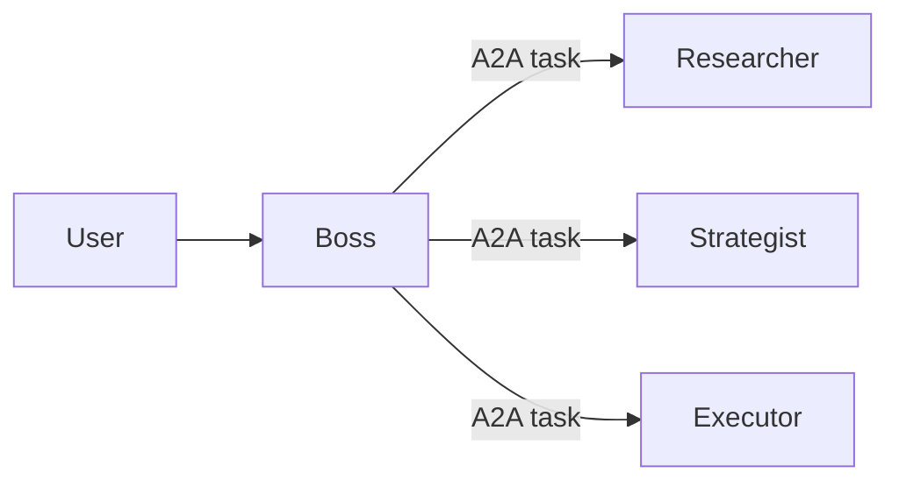

# Bot & Integration Best Practices

Patterns extracted from frog, owl3, fb2, `ckit_integrations_db`, `ckit_bunch_of_functions`, and `AGENTS.md`.
The goal: less code, more value. Follow all patterns that reduce code — they are how you pass review.
The canonical educational example is always `flexus_simple_bots/frog/`.

---

## File Structure

Every bot is three files + assets:

```
mybot/
  __init__.py
  mybot_bot.py        # TOOLS list, @rcx.on_tool_call handlers, main loop
  mybot_prompts.py    # System prompts only, nothing else
  mybot_install.py    # marketplace_upsert_dev_bot + EXPERTS
  mybot-1024x1536.webp
  mybot-256x256.webp
  setup_schema.json   # Load with json.loads(), not inline
  skills/             # SKILL.md files for on-demand instructions
  forms/              # Optional: custom HTML for microfrontend pdocs
```

---

## MCP First

If a provider has an official MCP server, use it — delete the custom `fi_*.py`.
MCP-related changes belong on the `oleg_mcp_within_bot` branch.

**Current limitation:** one API key per provider. If an integration needs multiple simultaneous keys, write a custom integration until multi-key is implemented.

---

## Integration: `BunchOfPythonFunctions` (preferred)

For external API integrations, use `BunchOfPythonFunctions` instead of a monolithic dispatch class.
The framework turns plain Python functions into LLM tools automatically — schema from type hints, description from docstring first line.

### Writing functions for a Bunch

```python
# integrations/facebook/campaigns.py

async def list_campaigns(
    client: FacebookAdsClient,   # first param = ContextType, always
    account_id: str,
    status: Optional[str] = None,
    limit: int = 25,
) -> str:
    """List campaigns for an ad account."""
    # ...
```

Rules:
- **First param is always ContextType** (e.g. `FacebookAdsClient`). It's injected by the framework, not exposed to model.
- **Type hints are mandatory** — they become the JSON schema. `Optional[T]` = optional param. `Literal["a","b"]` = enum.
- **Docstring first line** = method description shown to model.
- **Raise `OpError`** for expected user errors (returns `"ERROR: ..."` to model). Other exceptions are logged as warnings and also returned as errors.

### Assembling and registering a Bunch

```python
# fi_facebook2.py
def make_facebook_bunch(groups: list[str] | None = None) -> BunchOfPythonFunctions:
    b = BunchOfPythonFunctions("facebook", "Facebook/Instagram Marketing API.", ContextType=FacebookAdsClient)
    for g in (groups or ALL_FACEBOOK_GROUPS):
        if g == "campaign":
            from flexus_client_kit.integrations.facebook import campaigns
            b.add("campaign.", [campaigns.list_campaigns, campaigns.create_campaign])
        ...
    return b

class IntegrationFacebook2:
    def __init__(self, fclient, rcx, bunch):
        self.client = FacebookAdsClient(fclient, rcx)
        self._bunch = bunch

    async def called_by_model(self, toolcall, model_produced_args):
        auth_err = await self.client.ensure_auth()
        if auth_err:
            return auth_err
        return await self._bunch.called_by_model(self.client, toolcall, model_produced_args)
```

The model interacts via `op="list"` → `op="help"` → `op="call"` — all handled by the framework.

---

## Integrations Registry: `ckit_integrations_db`

Declare integrations at **module level** (evaluated once at startup), not inside the main loop.

```python
# mybot_bot.py (module level)
MYBOT_INTEGRATIONS = ckit_integrations_db.static_integrations_load(
    mybot_install.MYBOT_ROOTDIR,
    allowlist=["flexus_policy_document", "gmail", "facebook[campaign, adset]"],
    builtin_skills=mybot_install.MYBOT_SKILLS,
)

TOOLS = [
    MY_TOOL,
    *[t for rec in MYBOT_INTEGRATIONS for t in rec.integr_tools],
]
```

Bracket syntax `facebook[campaign, adset]` loads only those groups — keeps the model's tool context small.
**Note:** bracket syntax only works in code-defined bots, not `manifest.json`.

In the main loop, initialize once:

```python
async def mybot_main_loop(fclient, rcx):
    setup = ckit_bot_exec.official_setup_mixing_procedure(mybot_install.SETUP_SCHEMA, rcx.persona.persona_setup)
    integr_objects = await ckit_integrations_db.main_loop_integrations_init(MYBOT_INTEGRATIONS, rcx)
    pdoc = integr_objects["flexus_policy_document"]
    ...
```

---

## Tool Definition

### Strict mode (simple tools)

```python
MY_TOOL = ckit_cloudtool.CloudTool(
    strict=True,
    name="my_tool",
    description="What it does.",
    parameters={
        "type": "object",
        "properties": {
            "required_param": {"type": "string"},
            "optional_param": {"type": ["string", "null"]},  # null = optional in strict mode
            "enum_param": {"type": "string", "enum": ["a", "b", "c"]},
        },
        "required": ["required_param", "optional_param", "enum_param"],  # ALL params listed even optional ones
        "additionalProperties": False,
    },
)
```

`strict=True` requires: all params in `required`, `additionalProperties: false` on every nested object, optional params use `["type", "null"]`.

### One tool, multiple operations (preferred over separate tools per operation)

```python
UPDATE_STRATEGY_TOOL = ckit_cloudtool.CloudTool(
    strict=False,   # strict=False when enum values come from a runtime list
    name="update_strategy_section",
    description="Update a section of the strategy document. Fill in order: calibration → diagnostic → metrics.",
    parameters={
        "type": "object",
        "properties": {
            "section": {"type": "string", "enum": PIPELINE},
            "data": {"type": "object", "description": "Section content, freeform"},
        },
    },
)
```

Handler switches on `args["section"]`. Fewer tools = cleaner model context = fewer hallucinations.

---

## Skills: on-demand instruction sets

Skills are large instruction sets loaded into prompt only when needed, reducing prompt size at rest.

### File structure

```
skills/
  my-skill-name/
    SKILL.md           # frontmatter + instructions + optional json schema block
```

```markdown
---
name: my-skill-name
description: Brief description shown to model when listing available skills
---

# My Skill

Instructions here...

Optional JSON schema (picked up by load_skill_schemas()):
```json
{
  "type": "object",
  "properties": { ... }
}
```
```

### Loading skills at startup

```python
# mybot_install.py
MYBOT_ROOTDIR = Path(__file__).parent
MYBOT_SKILLS = ckit_skills.static_skills_find(MYBOT_ROOTDIR, shared_skills_allowlist="*")

# In EXPERTS:
fexp_builtin_skills=ckit_skills.read_name_description(MYBOT_ROOTDIR, MYBOT_SKILLS)
```

### Extracting schemas from SKILL.md (owl3 pattern)

When skills define JSON schemas, collect them at startup instead of duplicating in bot code:

```python
def load_skill_schemas() -> Dict[str, Any]:
    skills_dir = BOT_DIR / "skills"
    schema = {}
    for skill_dir in sorted(skills_dir.iterdir()):
        if not skill_dir.name.startswith("filling-"):
            continue
        md = (skill_dir / "SKILL.md").read_text()
        m = re.search(r"```json\s*(\{.*?\})\s*```", md, re.DOTALL)
        assert m, f"{skill_dir} has no schema block"
        schema[skill_dir.name.replace("filling-", "")] = json.loads(m.group(1))
    return schema

SKILL_SCHEMAS = load_skill_schemas()  # module-level, evaluated once
```

Embed into pdoc on write so the Schemed form editor works: `doc["strategy"]["schema"] = SKILL_SCHEMAS`.

---

## Fewer Bots, Fewer Experts — More Skills

**Principle:** before creating a new bot or a new expert, ask: can a skill solve this?

A skill is a SKILL.md loaded on demand into the existing prompt. It costs nothing at rest, loads instantly, and requires zero new code. A new bot or expert costs: new file set, new install, new main loop, new deployment, new maintenance surface.

| Need | Wrong | Right |
|------|-------|-------|
| Bot needs to know how to fill a form section | New expert with different prompt | Skill with filling instructions + JSON schema |
| Different behavior for a sub-task | New expert | Skill loaded in the same chat |
| Step-by-step domain guide | Separate bot | Skill in the parent bot |
| Specialized worker that runs 10 min and terminates | Subchat expert (acceptable) | — |

Owl3 eliminated all domain-specific expert variants by moving every section's instructions into `skills/filling-section*/SKILL.md`. The bot stays one expert with one prompt; the model calls `flexus_fetch_skill` when it needs to know what goes into a particular section.

**When a new expert IS justified:**
- Subchat that must terminate on a specific condition (needs its own Lark kernel)
- Genuinely separate toolset that would pollute the default context (e.g. `huntmode` in frog blocking irrelevant tools)
- A2A task receiver that should never talk to users directly

**When a new bot IS justified:**
- Different schedule, different kanban board, different domain owner
- Integration that requires a separate OAuth app / separate credentials
- Ops/infra bot vs user-facing bot

Otherwise: one bot, one default expert, many skills.

---

## Experts and Lark Kernels

Experts = separate system prompt + toolset. `"default"` is mandatory.

```python
EXPERTS = [
    ("default", ckit_bot_install.FMarketplaceExpertInput(
        fexp_system_prompt=mybot_prompts.main_prompt,
        fexp_python_kernel=DEFAULT_LARK,       # optional, runs before/after each assistant message
        fexp_block_tools="",
        fexp_allow_tools="",
        fexp_description="What this expert does",
        fexp_builtin_skills=ckit_skills.read_name_description(MYBOT_ROOTDIR, MYBOT_SKILLS),
    )),
    ("worker", ckit_bot_install.FMarketplaceExpertInput(
        fexp_system_prompt=mybot_prompts.worker_prompt,
        fexp_python_kernel=WORKER_LARK,        # must set subchat_result to terminate
        fexp_block_tools="tool_a,tool_b",      # comma-separated, wildcards ok: "*setup*"
        fexp_allow_tools="",
        fexp_description="Subchat worker expert",
    )),
]

# In install():
marketable_experts=[(name, exp.filter_tools(tools)) for name, exp in EXPERTS],
```

### Lark kernel: intercept assistant messages

```python
WORKER_LARK = """
msg = messages[-1]
if msg["role"] == "assistant" and "DONE" in str(msg["content"]):
    subchat_result = msg["content"]   # terminates subchat, returns this string as tool result
elif msg["role"] == "assistant" and len(msg["tool_calls"]) == 0:
    post_cd_instruction = "Keep going, don't stop early."
"""
```

Inputs: `messages`, `coins`, `budget`. Outputs: `subchat_result`, `post_cd_instruction`, `error`, `kill_tools`.
Prints go into `ftm_provenance.kernel_logs` — visible in logs for debugging.
**Subchat expert must set `subchat_result`** to complete; without it the subchat never terminates.

---

## Subchats (parallel workers)

```python
@rcx.on_tool_call(SPAWN_WORK_TOOL.name)
async def handle_spawn(toolcall, args):
    N = args["N"]
    subchats = await ckit_ask_model.bot_subchat_create_multiple(
        client=fclient,
        who_is_asking="mybot_worker",
        persona_id=rcx.persona.persona_id,
        first_question=[f"Process item #{i}" for i in range(N)],
        first_calls=["null" for _ in range(N)],
        title=[f"Item #{i}" for i in range(N)],
        fcall_id=toolcall.fcall_id,
        fexp_name="worker",
    )
    raise ckit_cloudtool.WaitForSubchats(subchats)
```

Tools with side effects must fake results when running scenarios:

```python
if rcx.running_test_scenario:
    return await ckit_scenario.scenario_generate_tool_result_via_model(rcx.fclient, toolcall, Path(__file__).read_text())
```

---

## Main Loop

```python
async def mybot_main_loop(fclient: ckit_client.FlexusClient, rcx: ckit_bot_exec.RobotContext) -> None:
    setup = ckit_bot_exec.official_setup_mixing_procedure(mybot_install.SETUP_SCHEMA, rcx.persona.persona_setup)
    integr_objects = await ckit_integrations_db.main_loop_integrations_init(MYBOT_INTEGRATIONS, rcx)

    @rcx.on_tool_call(MY_TOOL.name)
    async def handle_my_tool(toolcall, args):
        ...
        return "result"

    try:
        while not ckit_shutdown.shutdown_event.is_set():
            await rcx.unpark_collected_events(sleep_if_no_work=10.0)
    finally:
        logger.info("%s exit", rcx.persona.persona_id)
        # Close sockets, unsubscribe from external sources here
```

Use `ckit_shutdown.wait(seconds)` for polling loops — other sleep methods block shutdown.

---

## Choosing Data Storage

| Data type | Storage |
|-----------|---------|
| Config that rarely changes, admin-editable | **Bot settings** (`persona_setup`) |
| High-write logs, caches, per-user state, temp files | **MongoDB** — use TTL indexes for cleanup |
| Structured docs shared across bots, visible/editable in UI | **Policy documents** |
| Work items needing scheduling, prioritization, tracking | **Kanban** |
| External contacts | **ERP/CRM** |

---

## Policy Document Forms (choose one)

1. **QA** — questions/answers format, minimal code, most reliable. Use first.
2. **Schemed** — has `schema` + data in same doc, Schemed editor in UI. Use when QA can't represent the structure.
3. **Microfrontend** — custom HTML, maximum flexibility, maximum effort. Use only when Schemed can't.

Microfrontend setup:
```python
# In pdoc meta:
"meta": {"microfrontend": BOT_NAME, "created_at": "..."}
# UI loads: /v1/marketplace/{microfrontend}/{version}/forms/{top_level_tag}.html

# In install():
marketable_forms=ckit_bot_install.load_form_bundles(__file__),
```

---

## Setup Schema

Load from file, not inline:

```python
# mybot_install.py
SETUP_SCHEMA = json.loads((MYBOT_ROOTDIR / "setup_schema.json").read_text())

# In install():
marketable_setup_default=SETUP_SCHEMA,
```

Setup field types: `string_short`, `string_long`, `string_multiline`, `bool`, `int`, `float`.
Fields grouped by `bs_group` appear as tabs in UI.

---

## ERP/CRM Subscriptions

```python
# In main loop:
@rcx.on_erp_change("crm_contact")
async def on_contact_change(action, new_record, old_record):
    if action == "INSERT":
        logger.info("New contact: %s", new_record.contact_first_name)

# In main():
asyncio.run(ckit_bot_exec.run_bots_in_this_group(
    ...
    subscribe_to_erp_tables=["crm_contact"],
))
```

---

## Schedule Patterns

```python
# mybot_install.py
marketable_schedule=[
    prompts_common.SCHED_TASK_SORT_10M | {"sched_when": "EVERY:5m"},   # sort inbox
    prompts_common.SCHED_TODO_5M | {"sched_when": "EVERY:2m", "sched_first_question": "Work on the task."},
],
```

---

## System Prompt Guidelines

- Fix root cause, not specific test failures. Never write "if you see X then do Y".
- Minimize size — rewrite existing language instead of appending rules.
- Avoid excessive formatting and emojis. Use `#`, `##`, `###`, bullet lists.
- `💿` and `✍️` have special technical meaning in Flexus — only use them intentionally.
- Iterate: small change → run scenario → read score.yaml → repeat.

---

## Scenario Testing

```bash
python -m flexus_simple_bots.mybot.mybot_bot --scenario flexus_simple_bots/mybot/default__s1.yaml
```

Results in `scenario-dumps/mybot__s1-score.yaml` (gitignored). Read score.yaml — it's small and informative.
`shaky` in score = model is improvising (trajectory deviated from happy path).

---

## A2A Communication

```python
# Tell model to hand off a task to another bot:
# flexus_hand_over_task(to_bot="productman", description="...", fexp_name="default")
# Returns immediately — task goes into target bot's inbox queue.
```

---

## Pipeline Architecture: Boss + Worker Bots

For multi-stage GTM pipelines, use a boss→worker architecture rather than many sequential bots.



**Boss bot** owns all flow logic: stage gating, sequencing, deciding when to hand off to which worker. It reads pdoc state and creates kanban tasks for workers via `flexus_hand_over_task`. Workers don't know what came before or what comes after — they just do their job and write results to pdoc.

**Worker bots** are domain specialists with 1 default expert + many skills. Each skill covers what was formerly a separate bot.

**Tool isolation is informational, not permissive.** Load only the tools a bot needs via `static_integrations_load` allowlist and bracket syntax `facebook[campaign]`. Don't use `fexp_block_tools` for primary isolation — the bot simply shouldn't know about irrelevant tools.

**New expert only when** a subchat genuinely needs its own Lark kernel to terminate (different `subchat_result` logic). Domain variation → skill. Operational mode → skill. Everything else → default expert.

**Target ratio:** ~10 skills per bot, 1 expert per bot, 3 worker bots for a full GTM pipeline.

---

## Code Style Reminders

- No comments that narrate what the code does. Comments only for tricks, hacks, `XXX` future improvements.
- No docstrings on integration classes/methods (exception: `BunchOfPythonFunctions` functions — first line IS the schema description).
- Prefer `import xxx` then `xxx.f()` over `from xxx import f` for Flexus modules.
- No imports inside functions.
- No `MY_CONST = "my_const"` — use strings directly (breaks `\bsearch\b`).
- Trailing commas, indent independent of bracket position.
- Short variables for short-lived locals; longer names for ugly stack-persistent ones.
