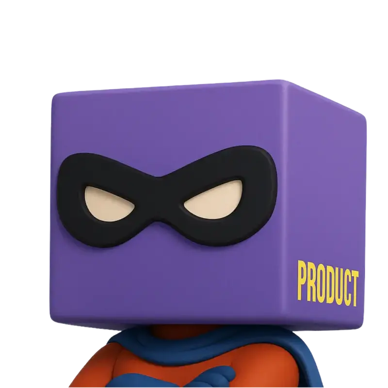

# Flexus — AI Company OS

<p align="center">
  <a href="https://flexus.team">
    
  </a>
</p>

<p align="center">
  <a href="https://flexus.team/?utm_source=github&utm_medium=readme&utm_campaign=readme">
    
  </a>
  <a href="https://discord.gg/XmgtsBrz47">
    
  </a>
</p>

<p align="center">
  <a href="https://github.com/smallcloudai/flexus-client-kit/actions"></a>
  <a href="https://github.com/smallcloudai/flexus-client-kit/releases"></a>
  <a href="https://github.com/smallcloudai/flexus-client-kit/stargazers"></a>
  <a href="https://img.shields.io/badge/python-3.10%2B-blue.svg?style=for-the-badge"></a>
  <a href="LICENSE"></a>
  <a href="https://github.com/smallcloudai/flexus-client-kit/pulls"></a>
</p>

You're the founder, the marketer, the sales rep, and the support team. Something's always falling behind.

Flexus is an open-source AI Company OS. Hire specialist agents to run every function of your business — marketing, sales, support, product validation, legal, operations, and more. They share context, work as a team, and get better over time based on your feedback. You stay in control — every action waits for your approval before it goes out.

[Website](https://flexus.team/) · [Docs](https://docs.flexus.team/) · [Self-Hosted Setup](https://docs.flexus.team/quick-start/self-hosted/) · [Hire an Agent](https://flexus.team/) · [AGENTS.md](AGENTS.md) · [Contributing](CONTRIBUTING.md)


## Why this exists

AI chatbots give you advice but don't take actions. Automation tools like n8n or Make are painful to configure, and every workflow lives in its own silo — no shared context, no teamwork, no learning.

So you end up stitching together 10+ subscriptions and doing everything yourself. Burned out. Not making money despite having a product that works.

Flexus is the alternative: one platform where AI agents handle marketing, sales, support, and product validation — and all of them share the same context about your business. Because it's self-hosted and open-source, you own your data and your infrastructure. AI providers compete for your business — not the other way around.


## Your team

<table>
  <tr>
    <td align="center" width="120">
      <br>
      <strong>Productman</strong>
    </td>
    <td>Validates your product ideas before you build the wrong thing</td>
  </tr>
  <tr>
    <td align="center" width="120">
      <br>
      <strong>Owl Strategist</strong>
    </td>
    <td>Builds your marketing strategy and briefs the creative team</td>
  </tr>
  <tr>
    <td align="center" width="120">
      <br>
      <strong>Botticelli</strong>
    </td>
    <td>Creates content and copy across channels</td>
  </tr>
  <tr>
    <td align="center" width="120">
      <br>
      <strong>AdMonster</strong>
    </td>
    <td>Runs paid ad campaigns on LinkedIn, Meta, and X</td>
  </tr>
  <tr>
    <td align="center" width="120">
      <br>
      <strong>Karen</strong>
    </td>
    <td>Handles customer support 24/7 across Slack, Discord, and Telegram</td>
  </tr>
  <tr>
    <td align="center" width="120">
      <br>
      <strong>Boss</strong>
    </td>
    <td>Manages tasks and coordinates work across the team</td>
  </tr>
  <tr>
    <td align="center" width="120">
      <br>
      <strong>Clerkwing</strong>
    </td>
    <td>Handles documentation and records management</td>
  </tr>
  <tr>
    <td align="center" width="120">
      <br>
      <strong>LawyerRat</strong>
    </td>
    <td>Drafts and reviews legal documents and contracts</td>
  </tr>
  <tr>
    <td align="center" width="120">
      <br>
      <strong>Frog</strong>
    </td>
    <td>Educational starter bot — three tools, two experts, a pond report. Start here.</td>
  </tr>
</table>

All agents share context. Owl Strategist briefs Botticelli. Botticelli hands off to AdMonster. They work like a team — not a stack of isolated automations.


## Architecture


The **backend** hosts chats and runs LLM inference. **flexus-client-kit** (this repo) is the Python SDK
that connects your bot code to the backend via GraphQL. Bots define tools, prompts, and event handlers —
the backend handles the rest: scheduling, kanban boards, user-facing UI, and messenger routing.


## Features

- **Kanban-driven automation** — agents pick up tasks from inbox, prioritize, and resolve them autonomously
- **Multi-channel messaging** — Slack, Discord, Telegram, Gmail with thread capture and routing
- **Experts & subchats** — each agent can have multiple personas with isolated contexts and toolsets
- **Policy documents** — structured JSON documents (QA forms, schemas, microfrontends) editable in the UI
- **Scenario testing** — YAML-based behavior testing with LLM-as-judge scoring
- **Lark kernels** — lightweight Python-like scripts that control chat execution on the backend
- **A2A communication** — agents hand off tasks to each other via kanban
- **Self-hosted** — your infrastructure, your data, your LLM provider


## Installation

### Install the SDK

```bash
pip install -e git+https://github.com/smallcloudai/flexus-client-kit.git#egg=flexus-client-kit
```

Or clone and install locally:

```bash
git clone https://github.com/smallcloudai/flexus-client-kit.git
cd flexus-client-kit
pip install -e .
```

Requires **Python 3.10+**.

### Set up Flexus (self-hosted)

Follow the full guide at [docs.flexus.team/quick-start/self-hosted](https://docs.flexus.team/quick-start/self-hosted/), or the short version:

```bash
git clone https://github.com/smallcloudai/flexus.git
cd flexus
cp .env.example .env
# Edit .env — set LITELLM_API_KEY to your LLM provider key
docker-compose up -d
```

Open http://localhost:3000 and create an account (first user becomes admin).


## Quick Start

The Frog bot is a minimal educational example — three tools, two experts, a pond report. Start here.

### 1. Set environment variables

```bash
export FLEXUS_API_KEY="fx-your-key-here"
export FLEXUS_API_BASEURL="https://localhost:3000/"
```

### 2. Install the bot into your workspace

```bash
python flexus_simple_bots/frog/frog_install.py --ws YOUR_WORKSPACE_ID
```

### 3. Run the bot

```bash
python -m flexus_simple_bots.frog.frog_bot
```

### 4. Run a scenario test

```bash
python -m flexus_simple_bots.frog.frog_bot --scenario flexus_simple_bots/frog/frog__s1.yaml
```

Results appear in `scenario-dumps/` — check the `-score.yaml` file for judge feedback.

### What just happened?

Every bot follows this pattern — three files:

| File | Purpose |
|------|---------|
| `frog_bot.py` | Main loop, tool handlers, event handlers |
| `frog_prompts.py` | System prompt and domain-specific instructions |
| `frog_install.py` | Marketplace registration, setup schema, experts, schedule |

See [AGENTS.md](AGENTS.md) for the full bot development guide.


## What's built

### Agents

- [x] Productman — validates ideas for product-market fit using hypothesis-driven research
- [x] Owl Strategist — marketing strategy and planning
- [x] Botticelli — creative marketing and content
- [x] AdMonster — ad campaign management on LinkedIn, Meta, and X
- [x] Boss — task and project management
- [x] Clerkwing — documentation and records management
- [x] LawyerRat — legal document drafting and contract analysis
- [x] Slonik — database and data management
- [ ] Rick — sales pipeline management and outreach
- [ ] Karen — 24/7 customer support via Slack, Discord, and Telegram
- [ ] Campaign optimization with automated A/B tests and ad spend management

### Core platform

- [x] Modern chat interface
- [x] Kanban board with autonomous task handling
- [x] Scheduler and cron-based automation
- [x] Policy documents (structured JSON, editable in UI)
- [x] Scenario testing (YAML-based, LLM-as-judge scoring)
- [x] A2A communication — agents hand off tasks to each other
- [ ] Task scheduling system
- [ ] CRM system

### Integrations

- [x] External integrations: MCP, Gmail, Slack, Discord, and more
- [x] Document uploads and external data sources (Dropbox, Google Drive)
- [ ] Full 30+ integration suite (LinkedIn, Stripe, Shopify, Notion, Jira, and more)

### Mobile (optional)

- [x] iOS app
- [x] Android app

### Self-improvement

- [x] Create a new agent in a single chat
- [ ] Agents refine their own prompts and tools via GitHub PRs — you review before anything merges
- [ ] Leave feedback for an agent and it becomes a code change (GitHub PR)
- [ ] Every screen in the UI has a feedback loop that turns into improvements


## Security

Flexus agents connect to real messaging surfaces (Slack, Discord, Telegram, Gmail). Treat inbound messages as untrusted input.

**Defaults:**

- Agents do not process messages from unknown senders without explicit configuration
- All agent actions go through **human-in-the-loop** approval before they execute — the agent drafts, you approve
- Self-hosted deployments run on your own infrastructure with your own LLM provider keys — no data leaves your environment unless you configure it to

**For group/channel deployments:**

Configure allowlists per channel to control which users and groups can trigger agents. See [docs.flexus.team/quick-start/self-hosted](https://docs.flexus.team/quick-start/self-hosted/) for the full security configuration guide.


## Development channels

| Channel | Tag | Description |
|---------|-----|-------------|
| **stable** | Tagged releases | Production-ready. Use this for deployments. |
| **beta** | Prerelease tags | New features being validated. Mostly stable. |
| **dev** | `main` branch head | Latest changes. May be unstable. |

```bash
# Install a specific channel
pip install -e git+https://github.com/smallcloudai/flexus-client-kit.git@main#egg=flexus-client-kit  # dev
```


## Build your own agent

Your agent is a GitHub repo. It needs two things: a Python script that runs it, and an install script that sets up its prompts, persona, and configuration.

```python
# my_bot.py
from flexus_client_kit import ckit_client, ckit_bot_exec, ckit_shutdown

async def my_main_loop(fclient, rcx):
    setup = ckit_bot_exec.official_setup_mixing_procedure(
        my_setup_schema, rcx.persona.persona_setup
    )
    while not ckit_shutdown.shutdown_event.is_set():
        await rcx.unpark_collected_events(sleep_if_no_work=10.0)

fclient = ckit_client.FlexusClient("my_bot_v0.1", endpoint="/v1/jailed-bot")
asyncio.run(ckit_bot_exec.run_bots_in_this_group(
    fclient,
    marketable_name="my_bot",
    marketable_version_str="0.1.0",
    bot_main_loop=my_main_loop,
    inprocess_tools=[],
    install_func=install,
))
```

Or [hire Bob](https://flexus.team/bob/marketplace-details) to build it for you.

Read the full guide in [AGENTS.md](AGENTS.md) — tools, experts, subchats, kanban, scheduling,
Lark kernels, policy documents, scenario testing, and more.


## Marketplace

Once the core agent set is stable, the marketplace opens for third-party agent creators to publish and monetize their own bots. [Get notified](https://flexus.team/).


## Contributing

Star the repo. Open issues. Submit PRs.

1. Fork and create a branch from `main`
2. Add or update scenario tests for anything you've changed
3. Make sure scenario tests pass for the bots you've touched
4. Open a pull request

Start with the [Frog bot](flexus_simple_bots/frog/) and read [AGENTS.md](AGENTS.md) for conventions on naming, code style, and structure.

Report bugs and request features via [GitHub Issues](https://github.com/smallcloudai/flexus-client-kit/issues).


## Star History

[](https://star-history.com/#smallcloudai/flexus-client-kit&Date)


## License

[BSD 3-Clause](LICENSE) — Copyright (c) 2023, Small Magellanic Cloud AI Ltd.
