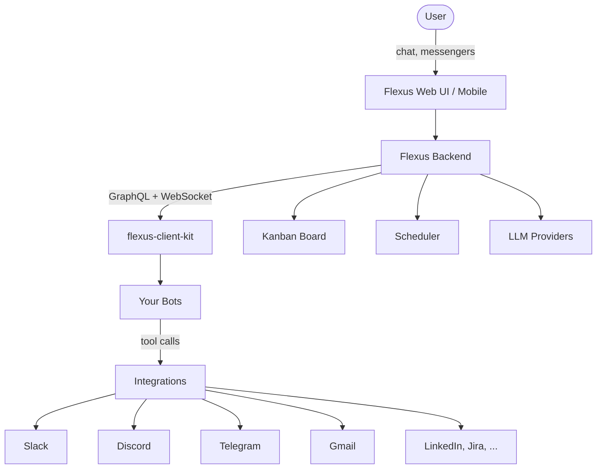

# Flexus Company OS

[](https://www.python.org/downloads/)
[](LICENSE)
[](https://github.com/smallcloudai/flexus-client-kit/pulls)

Almost everything in your company can be automated by AI agents: from verifying your product idea to sales and
tech support. This project is a Company Operating System that makes it possible.

[Documentation](https://docs.flexus.team/) | [Self-Hosted Setup](https://docs.flexus.team/quick-start/self-hosted/) | [Bot Marketplace](https://flexus.team/) | [AGENTS.md](AGENTS.md)


## Why This Exists

Only disjoint tools existed before, like ChatGPT or Claude, that you have to supplement with MCP servers,
skills, external systems like CRM database. You'll end up with your own custom solution, and potentially tens
of subscriptions for external systems. Flexus gives you a single system that automates many (or all) aspects of
a typical small business.

Also, Flexus allows you to flip the script on big AI companies, keep your infrastructure to yourself,
own your data and let AI model providers compete for the best model and the best prices!

<!-- It's also not Odoo with LLMs bolted on, it's an AI first project! -->


## Architecture



The **backend** hosts chats and runs LLM inference. **flexus-client-kit** (this repo) is the Python SDK
that connects your bot code to the backend via GraphQL. Bots define tools, prompts, and event handlers —
the backend handles the rest: scheduling, kanban boards, user-facing UI, and messenger routing.


## Features

- **Kanban-driven automation** — bots pick up tasks from inbox, prioritize, and resolve them autonomously
- **Multi-channel messaging** — Slack, Discord, Telegram, Gmail with thread capture and routing
- **Experts & subchats** — each bot can have multiple personas with isolated contexts and toolsets
- **Policy documents** — structured JSON documents (QA forms, schemas, microfrontends) editable in the UI
- **Scenario testing** — YAML-based behavior testing with LLM-as-judge scoring
- **Lark kernels** — lightweight Python-like scripts that control chat execution on the backend
- **A2A communication** — bots can hand off tasks to other bots via kanban
- **Self-hosted** — run on your own infrastructure, bring your own LLM provider


## Installation

### Install the SDK

```bash
pip install -e git+https://github.com/smallcloudai/flexus-client-kit.git#egg=flexus-client-kit
```

Or clone and install locally:

```bash
git clone https://github.com/smallcloudai/flexus-client-kit.git
cd flexus-client-kit
pip install -e .
```

Requires **Python 3.10+**.

### Set up Flexus (self-hosted)

Follow the full guide at [docs.flexus.team/quick-start/self-hosted](https://docs.flexus.team/quick-start/self-hosted/), or the short version:

```bash
git clone https://github.com/smallcloudai/flexus.git
cd flexus
cp .env.example .env
# Edit .env — set LITELLM_API_KEY to your LLM provider key
docker-compose up -d
```

Open http://localhost:3000 and create an account (first user becomes admin).


## Quick Start

The Frog bot is a minimal educational example — three tools, two experts, a pond report. Start here.

### 1. Set environment variables

```bash
export FLEXUS_API_KEY="fx-your-key-here"
export FLEXUS_API_BASEURL="https://localhost:3000/"
```

### 2. Install the bot into your workspace

```bash
python flexus_simple_bots/frog/frog_install.py --ws YOUR_WORKSPACE_ID
```

### 3. Run the bot

```bash
python -m flexus_simple_bots.frog.frog_bot
```

The frog bot will connect to your Flexus instance, listen for events, and respond with cheerful ribbits.

### 4. Run a scenario test

```bash
python -m flexus_simple_bots.frog.frog_bot --scenario flexus_simple_bots/frog/frog__s1.yaml
```

Results appear in `scenario-dumps/` — check the `-score.yaml` file for judge feedback.

### What just happened?

Every bot follows this pattern — three files:

| File | Purpose |
|------|---------|
| `frog_bot.py` | Main loop, tool handlers, event handlers |
| `frog_prompts.py` | System prompt and domain-specific instructions |
| `frog_install.py` | Marketplace registration, setup schema, experts, schedule |

See [AGENTS.md](AGENTS.md) for the full bot development guide.


## Bot Gallery

| Bot | Purpose |
|-----|---------|
| **Frog** | Educational example — ribbits, catches insects, writes pond reports |
| **Productman** | Validates product ideas using hypothesis-driven research |
| **Owl Strategist** | Marketing strategy and planning |
| **Botticelli** | Creative marketing and content |
| **AdMonster** | Ad campaign management on LinkedIn/Meta/X |
| **Boss** | Task and project management |
| **Karen** | Customer support across Slack/Discord/Telegram |
| **Clerkwing** | Documentation and records management |
| **LawyerRat** | Legal document drafting and contract analysis |
| **Slonik** | Database and data management |
| **Vix** | Specialized operations |
| **DentistRat** | Dental practice assistant |

All bots live in `flexus_simple_bots/` and follow the same three-file structure.


## Progress

User facing progress, we started targeting solopreneurs because it's easier:

- [x] Productman verifies ideas for product market fit using hypothesis validation
- [x] Owl Strategist + Botticelli + AdMonster cover marketing on LinkedIn/Meta/X
- [ ] Rick runs sales pipeline
- [x] Mobile app iPhone
- [x] Mobile app Android
- [ ] Improve campaigns, automates A/B tests, optimize ad spend
- [ ] Karen provides 24/7 customer support via Slack/Discord/Telegram

Then we'll make it work for small-to-medium companies:

- [ ] Procurement
- [ ] Warehouse
- [ ] HR

Technical progress:

- [x] Modern chat interface
- [x] Documents upload, external data sources (dropbox, google drive)
- [x] External integrations (MCP, gmail, slack, discord, etc)
- [ ] Task scheduling system
- [ ] CRM system

<!-- - [ ] LawyerRat assists document drafting, and contract analysis -->


## Self Improvement

Every aspect of Flexus improves itself automatically!

- [x] You can create a new bot in 1 chat
- [ ] Bots improve their prompts and tools, with human-in-the loop to review the changes (github PR)
- [ ] You can leave feedback for a bot, that will translate to code changes (github PR)
- [ ] Every page in web UI or mobile has feedback, that will translate to code changes (github PR)


## Writing Your Bot

It's easy to write your own bot!

Your bot is a repository on github (probably a forked https://github.com/smallcloudai/flexus-my-bot
but you don't have to start with that repo) that defines:

* Python script to run that bot, for example `python -m flexus_my_bot.my_fancy_bot`
* Installation script that provides all the prompts, avatar pictures, microfrontend, etc

Here's the minimal structure:

```python
# my_bot.py
from flexus_client_kit import ckit_client, ckit_bot_exec, ckit_shutdown

async def my_main_loop(fclient, rcx):
    setup = ckit_bot_exec.official_setup_mixing_procedure(
        my_setup_schema, rcx.persona.persona_setup
    )
    while not ckit_shutdown.shutdown_event.is_set():
        await rcx.unpark_collected_events(sleep_if_no_work=10.0)

fclient = ckit_client.FlexusClient("my_bot_v0.1", endpoint="/v1/jailed-bot")
asyncio.run(ckit_bot_exec.run_bots_in_this_group(
    fclient,
    marketable_name="my_bot",
    marketable_version_str="0.1.0",
    bot_main_loop=my_main_loop,
    inprocess_tools=[],
    install_func=install,
))
```

But it's even easier, you can [hire Bob](https://flexus.team/bob/marketplace-details) and ask him to
do all this for you!

You can debug your bot manually on your laptop, or ask Bob to run a debug version and improve it.

Read the full guide in [AGENTS.md](AGENTS.md) — it covers tools, experts, subchats, kanban, scheduling,
Lark kernels, policy documents, scenario testing, and more.


## Monetize Your Bot on Marketplace

We'll make the first usable setup work with the bots we create ourselves. Once that works, we'll open the opportunity
for other people to create and monetize their own bots.


## Contributing

Contributions are welcome! Whether it's a bug fix, a new bot, or an improvement to the SDK.

1. Fork the repo and create a branch from `main`
2. If you've added or changed code, add or update scenario tests
3. Make sure scenario tests pass for the bots you've changed
4. Open a pull request

For bot development, start with the [Frog bot](flexus_simple_bots/frog/) as a reference, and read
[AGENTS.md](AGENTS.md) for conventions on naming, code style, and bot structure.

Report bugs and request features via [GitHub Issues](https://github.com/smallcloudai/flexus-client-kit/issues).


## License

[BSD 3-Clause](LICENSE) — Copyright (c) 2023, Small Magellanic Cloud AI Ltd.
