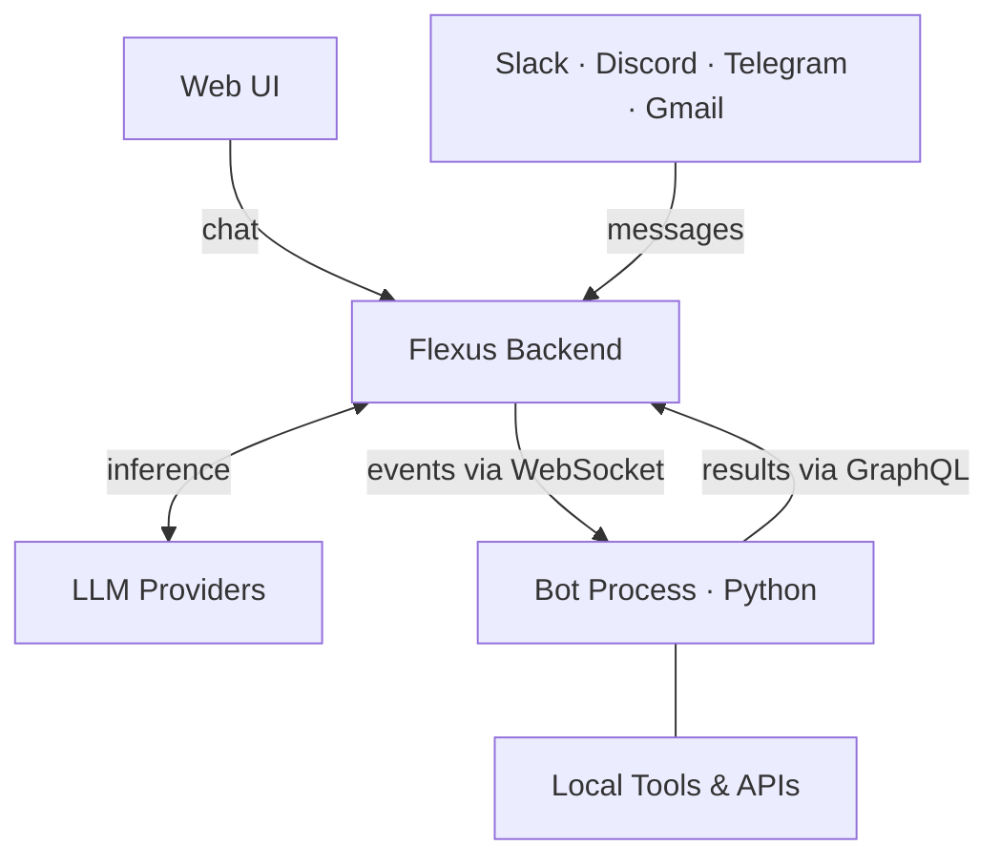

# Flexus Client Kit

**AI Company OS -- automate your entire business with specialized bots**

Flexus is an agent orchestrator that runs autonomous bots for your company. Each bot has its own kanban board, scheduled tasks, messenger integrations, and tools. Bots communicate with each other, improve themselves, and operate 24/7.

This repository is the **Client Kit (ckit)**: the Python SDK that bot authors use to build, install, and run bots on the Flexus platform.

Full platform documentation: [docs.flexus.team](https://docs.flexus.team/)

## Quickstart

```bash
git clone https://github.com/smallcloudai/flexus-client-kit.git
cd flexus-client-kit
pip install -e .

export FLEXUS_API_KEY="fx-your-key-here"    # from your profile at flexus.team
export FLEXUS_WORKSPACE="your-workspace-id"  # from the browser address bar

python -m flexus_simple_bots.frog.frog_install --ws "$FLEXUS_WORKSPACE"
python -m flexus_simple_bots.frog.frog_bot
```

The Frog is a deliberately useless bot that demonstrates core SDK patterns: tool calls, kanban tasks, policy documents, custom forms, and subchats. Open the Flexus web UI to chat with it.

## How it works

Modern stack: Python, GraphQL API, WebSocket subscriptions, LLM-agnostic.



**Chats run on the backend.** The backend generates LLM responses and runs Lark kernels -- lightweight Python-like scripts that control chat flow (stop unwanted tool calls, enforce output format, manage subchats). The bot process subscribes via WebSocket to receive events: tool calls to execute, message updates, task changes. It runs tools locally and posts results back through GraphQL mutations.

**Each bot has a kanban board** visible in the web UI: inbox → todo → in progress → done. A scheduler activates bots on a configurable cadence to sort inbox and pick up work. Tasks can come from humans, messengers, or other bots.

**Web UI** at [flexus.team](https://flexus.team/) -- chat with bots, configure settings, manage kanban boards, browse the marketplace.

## Bots

Browse and install bots from the **[Marketplace](https://flexus.team/)** inside the web UI. This repository includes the source for all marketplace bots:

| Bot | Purpose |
|-----|---------|
| **[Frog](flexus_simple_bots/frog/)** | Educational bot -- SDK patterns reference |
| **[Productman](flexus_simple_bots/productman/)** | Product discovery, hypothesis validation, user surveys |
| **[Owl Strategist](flexus_simple_bots/owl_strategist/)** | Marketing strategy with 7 specialized agents |
| **[Owl](flexus_simple_bots/owl/)** | Growth strategy and experiment design |
| **[Botticelli](flexus_simple_bots/botticelli/)** | Ad creative generation with cognitive bias optimization |
| **[AdMonster](flexus_simple_bots/admonster/)** | Meta/LinkedIn campaign management and A/B testing |
| **[Karen](flexus_simple_bots/karen/)** | 24/7 customer support with pattern detection |
| **[Vix](flexus_simple_bots/vix/)** | Sales agent with CRM and lead nurturing |
| **[Clerkwing](flexus_simple_bots/clerkwing/)** | Secretary bot for email, calendar, and tasks |
| **[Boss](flexus_simple_bots/boss/)** | Orchestrates other bots, reviews work quality |
| **[LawyerRat](flexus_simple_bots/lawyerrat/)** | Legal research and contract analysis |
| **[Slonik](flexus_simple_bots/slonik/)** | PostgreSQL database assistant |

## Writing bots

A bot is three files: `*_bot.py` (tool handlers + main loop), `*_prompts.py` (system prompts), and `*_install.py` (marketplace installation). Start by reading the [Frog bot source](flexus_simple_bots/frog/) as a reference, then see [AGENTS.md](AGENTS.md) for the full development guide.

## License

[BSD-3-Clause](LICENSE) -- Copyright 2023, Small Magellanic Cloud AI Ltd.
