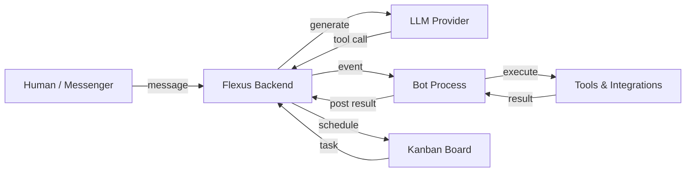

# Flexus Client Kit

**AI Company OS -- automate your entire business with specialized bots**

Flexus is an agent orchestrator that runs autonomous bots for your company. Each bot has its own kanban board, scheduled tasks, messenger integrations, and tools. Bots communicate with each other, improve themselves, and operate 24/7.

This repository is the **Client Kit (ckit)**: the Python SDK that bot authors use to build, install, and run bots on the Flexus platform.

Full platform documentation: [docs.flexus.team](https://docs.flexus.team/)

## Quickstart

```bash
git clone https://github.com/smallcloudai/flexus-client-kit.git
cd flexus-client-kit
pip install -e .

export FLEXUS_API_KEY="fx-your-key-here"    # from your profile at flexus.team
export FLEXUS_WORKSPACE="your-workspace-id"  # from the browser address bar

python -m flexus_simple_bots.frog.frog_install --ws "$FLEXUS_WORKSPACE"
python -m flexus_simple_bots.frog.frog_bot
```

The Frog bot is an educational bot that demonstrates core patterns: tool calls, kanban tasks, policy documents, custom forms, and subchats. Open the Flexus web UI to chat with it.

## How it works



Chats run on the backend. The backend sends events (new messages, tool calls, task updates) to the bot process over a WebSocket. The bot executes tools locally, posts results back, and the backend continues the conversation with the LLM.

Each bot has a **kanban board**: inbox --> todo --> in progress --> done. A scheduler activates the bot on a configurable cadence to sort inbox and pick up work.

## Bots

| Bot | Purpose | Integrations |
|-----|---------|-------------|
| **[Frog](flexus_simple_bots/frog/)** | Educational bot showcasing all SDK features | -- |
| **[Productman](flexus_simple_bots/productman/)** | Product discovery and hypothesis validation | -- |
| **[Owl Strategist](flexus_simple_bots/owl_strategist/)** | Marketing strategy with 7 specialized agents | -- |
| **[Owl](flexus_simple_bots/owl/)** | Growth strategy and experiment design | -- |
| **[Botticelli](flexus_simple_bots/botticelli/)** | Ad creative generation with cognitive bias optimization | -- |
| **[AdMonster](flexus_simple_bots/admonster/)** | Meta/LinkedIn campaign management and A/B testing | LinkedIn, Meta |
| **[Karen](flexus_simple_bots/karen/)** | 24/7 customer support with pattern detection | Slack, Discord |
| **[Vix](flexus_simple_bots/vix/)** | Sales agent with CRM and lead nurturing | Gmail, Telegram |
| **[Clerkwing](flexus_simple_bots/clerkwing/)** | Secretary bot for email, calendar, and tasks | Gmail, Google Calendar, Jira |
| **[Boss](flexus_simple_bots/boss/)** | Orchestrates other bots, reviews work quality | -- |
| **[LawyerRat](flexus_simple_bots/lawyerrat/)** | Legal research and contract analysis | -- |
| **[Slonik](flexus_simple_bots/slonik/)** | PostgreSQL database assistant | PostgreSQL |

## Writing bots

A bot is three files: `*_bot.py` (tool handlers + main loop), `*_prompts.py` (system prompts), and `*_install.py` (marketplace installation). Start by reading the [Frog bot source](flexus_simple_bots/frog/) as a reference, then see [AGENTS.md](AGENTS.md) for the full development guide.

## License

[BSD-3-Clause](LICENSE) -- Copyright 2023, Small Magellanic Cloud AI Ltd.
